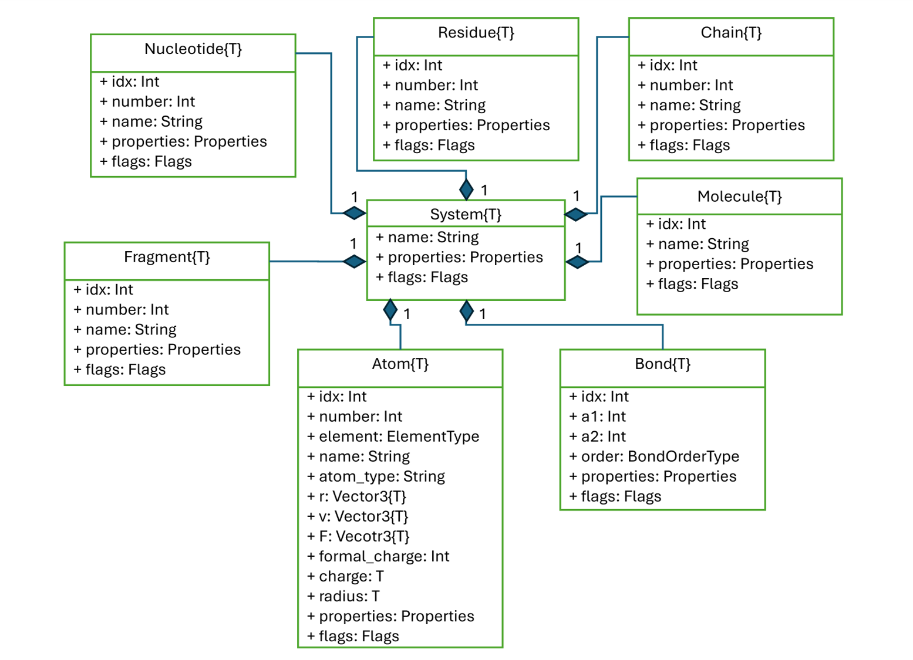

# Getting started


BiochemicalAlgorithms.jl\`s design is inspired by its predecessor [`BALL`](https://github.com/ball-project/ball). BALL and BiochemicalAlgorithms.jl both have a set of KERNEL classes or core classes to represent molecular entities such as Molecules, Proteins, Atoms, Bonds etc. The following class diagramm shows the different classes and their relationship to each others.



UML class diagram *Note*: Only the most important functionalities are shown here.

In the center of all classes resides the [`System`](@ref). So let’s see it in action with a simple peptide:

``` julia
using BiochemicalAlgorithms

s = load_pdb(ball_data_path("../test/data/AlaAla.pdb"))
s
```

    System{Float32}: AA
      23 atoms
       0 bonds
       1 molecules
       1 chains
       1 secondary structures
       2 fragments

This will give us an overview of the objects associated with our system. It contains 23 atoms, 0 bonds, 1 molecule, 1 chain, 0 secondary structures and 2 fragments. We look at each group separately in the following sections.

If we do not explicitely create a system, the data will be stored in the default system:

``` julia
load_pdb(ball_data_path("../test/data/AlaAla.pdb"))
```

    System{Float32}: AA
      23 atoms
       0 bonds
       1 molecules
       1 chains
       1 secondary structures
       2 fragments

## Atom

We can access the atoms like this:

``` julia
sys_atms = atoms(s)

natoms(sys_atms)
```

    23

Let’s play around with it:

``` julia
println("Atom elements:")
for a in sys_atms
    print(a.element)
end
println()

n1 = atom_by_name(s, "N")

println(n1.idx)
```

    Atom elements:
    NCCOHHHHHHCHNCCHHHHCHOO
    4

We can access an atom by its name, which will return the first atom matching the given name. If there are more atoms with the same name and we are not interested in the first one, we can access the atom by the atom index.
The atom index is unique inside a system but not necessarily starting by one.

``` julia
println("Atom ids:")
for a in sys_atms
    println(a.idx, " ", a.element)
end

n2 = atom_by_idx(s, 17)
```

    Atom ids:
    4 N
    5 C
    6 C
    7 O
    8 H
    9 H
    10 H
    11 H
    12 H
    13 H
    14 C
    15 H
    17 N
    18 C
    19 C
    20 H
    21 H
    22 H
    23 H
    24 C
    25 H
    26 O
    27 O

    BiochemicalAlgorithms.Atom{Float32}: (idx = 17, number = 13, element = BiochemicalAlgorithms.Elements.N, name = "N", atom_type = "", r = Float32[0.133, 0.98, 2.268], v = Float32[0.0, 0.0, 0.0], F = Float32[0.0, 0.0, 0.0], formal_charge = 0, charge = 0.0f0, radius = 0.0f0)

[`Atom`](@ref) features the atom number as well. The atom number does NOT have to be unique inside the system!

``` julia
for a in sys_atms
    println(a.idx, " ", a.number)
end
```

    4 1
    5 2
    6 3
    7 4
    8 5
    9 6
    10 7
    11 8
    12 9
    13 10
    14 11
    15 12
    17 13
    18 14
    19 15
    20 16
    21 17
    22 18
    23 19
    24 20
    25 21
    26 22
    27 23

Next, we will have a look at `Bond`.

## Bond

BiochemicalAlgorithms.jl supports different BondTypes:

``` julia
BiochemicalAlgorithms.BondOrderType
```

    Enum type BondOrder.T <: Enum{Int32} with 6 instances:
     BondOrder.Single    = 1
     BondOrder.Double    = 2
     BondOrder.Triple    = 3
     BondOrder.Quadruple = 4
     BondOrder.Aromatic  = 50
     BondOrder.Unknown   = 100

Typically, bonds are not included in the PDB-FileFormat and have to be computed. This can be achieved with the FragmentDataBase, which contains known fragments (all amino acids such as alanine, all nucleotides, same ions …). If you are interested in the fragments contained in the default FragmentDB, take a look at data/fragments of the repository. There you find all the fragments, each one stored in a separate json format.
So let’s take a look at the FragmentDB and bonds:

``` julia
s = load_pdb(ball_data_path("../test/data/AlaAla.pdb"))
nbonds(s)
```

    0

So far, the system has no bonds. We can also visualize the structure using BiochemicalVisualization.jl.

If BiochemicalVisualization is not yet installed, you can add it via:

``` julia
using Pkg
Pkg.add("BiochemicalVisualization")
```

``` julia
using BiochemicalVisualization

ball_and_stick(s)
```

Now, let’s create some bonds:

``` julia
fdb = FragmentDB() # default FragmentDB
normalize_names!(s, fdb) # in case our input PDB file uses a strange naming standard
reconstruct_fragments!(s, fdb) # in case our input file misses some atoms
build_bonds!(s, fdb) # create the bonds
# ball_and_stick(s) uncomment for visualization
```

    [ Info: reconstruct_fragments!(): added 0 atoms.
    [ Info: build_bonds!(): built 22 bonds

And finally, we do have our bonds. This example demonstrate the importance of visualizing for the understanding of structural data.
Note: The exclamation mark behind the function name indicates that the system will be changed through the functions. The system now contains bonds and the residues carries flags:

``` julia
println(s)
for i in residues(s)
    println(i.flags)
end
```

    BiochemicalAlgorithms.System{Float32} with 23 atoms and 22 bonds (AA)
    Set([:N_TERMINAL])
    Set([:C_TERMINAL])

Let’s take a deeper look at the bonds. Bond are only formed inside the same system and not across systems.

``` julia
bonds(s)
```

| **\#** | **idx** | **a1** | **a2** | **order** |
|-------:|:--------|:-------|:-------|:----------|
|      1 | 29      | 4      | 12     | Single    |
|      2 | 30      | 4      | 5      | Single    |
|      3 | 31      | 4      | 8      | Single    |
|      4 | 32      | 4      | 10     | Single    |
|      5 | 33      | 5      | 15     | Single    |
|      6 | 34      | 5      | 6      | Single    |
|      7 | 35      | 5      | 14     | Single    |
|      8 | 36      | 6      | 7      | Double    |
|      9 | 37      | 9      | 14     | Single    |
|     10 | 38      | 11     | 14     | Single    |
|     11 | 39      | 13     | 14     | Single    |
|     12 | 40      | 17     | 20     | Single    |
|     13 | 41      | 17     | 18     | Single    |
|     14 | 42      | 18     | 25     | Single    |
|     15 | 43      | 18     | 19     | Single    |
|     16 | 44      | 18     | 24     | Single    |
|     17 | 45      | 19     | 26     | Double    |
|     18 | 46      | 19     | 27     | Single    |
|     19 | 47      | 21     | 24     | Single    |
|     20 | 48      | 22     | 24     | Single    |
|     21 | 49      | 23     | 24     | Single    |
|     22 | 50      | 6      | 17     | Single    |

Bonds can be accessed via their respective index, deleted, and be put in the system

``` julia
bond = bond_by_idx(s, 30)
println("Bond index: ", bond.idx, ", between atom ", bond.a1, " and ", bond.a2, ", with order: ", bond.order)

println("Bonds in the system: ", nbonds(s))

delete!(bond)

println("Bonds in the system after deletion: ", nbonds(s))

bond = Bond(s, 5, 13, BondOrder.Single)

println("Bonds in the system after deletion: ", nbonds(s))
```

    Bond index: 30, between atom 4 and 5, with order: Single
    Bonds in the system: 22
    Bonds in the system after deletion: 21
    Bonds in the system after deletion: 22

Be careful: The bond index is now different because it is a new Bond object:

``` julia
bond.idx
```

    51

Another helpful functionalities when it comes to bonds are the following:

``` julia
# get the atoms sharing a bond
a1, a2 = get_partners(bond)

# or if we have only given one atom
atom = atom_by_idx(s, 12)
bond = bonds(atom)[1]
partner_atom = get_partner(bond, atom)
println(partner_atom.idx)
println("The bond length is ", bond_length(bond))
```

    4
    The bond length is 1.0135294

Sometimes it is necessary to discriminate between hydrogen and nonhydrogen_bonds. Since this a common use case, there are built in functionalities:

## Fragment

Fragments represent molecule fragments. In context of proteins or nucleic acids, the fragment can be used to represent residues or nucleotides. See the documentation for the definition of the [`FragmentVariantType`](@ref)

``` julia
nfragments(s)

for frag in fragments(s)
    println(frag.name, " ", frag.idx)
end
n2 = atom_by_idx(s, 5)

println("The N atom belongs to residue: ", n2.fragment_idx)
```

    ALA 3
    ALA 16
    The N atom belongs to residue: 3

We can get the fragment as well directly:

``` julia
fragment = parent_fragment(n2)
println(fragment)
res2 = fragment_by_idx(s, 3)
```

    BiochemicalAlgorithms.Fragment{Float32}: (idx = 3, number = 1, name = "ALA")

    BiochemicalAlgorithms.Fragment{Float32}: (idx = 3, number = 1, name = "ALA")

Just like atom indices, fragment indices not necessarily follow a certain order but are unique inside the same system object.

``` julia
res1 = fragments(s)[1]
res1.variant # 1 = unknown, 2 = residue, 3 = nucleotide
```

    FragmentVariant.Residue = 2

Alternatively, it is also possible to check if this is a nucleotide:

``` julia
println(is_nucleotide(res1))

println("Number of fragments before push: ", nfragments(s))
push!(chain_by_idx(s, 2), res1)
println("Number of fragments after push: ", nfragments(s))
delete!(res1)
println("Number of fragments after deletion: ", nfragments(s))

for frag in fragments(s)
    println(frag.name, " ", frag.idx)
end
s
```

    false
    Number of fragments before push: 2
    Number of fragments after push: 3
    Number of fragments after deletion: 2
    ALA 16
    ALA 52

    System{Float32}: AA
      11 atoms
      10 bonds
       1 molecules
       1 chains
       1 secondary structures
       2 fragments

Or a residue:

``` julia
s = load_pdb(ball_data_path("../test/data/AlaAla.pdb")) # restore original data
res1 = fragments(s)[1]
println("is residue ", isresidue(res1))
```

    is residue true

There are more functionalities related to fragments. Have a look at the documentation for [`Fragment`](@ref) for more details.

## Residue

As described in the Fragments section, [`Residue`](@ref) is a Fragment with `FragmentVariant.Residue` and typically describes an amino acid:

``` julia
s = load_pdb(ball_data_path("../test/data/AlaAla.pdb")) # restore original data
res = fragments(s)[1]
println("is_amino_acid(): ", is_amino_acid(res))
println("is_c_terminal(): ", is_c_terminal(res))
println("is_n_terminal(): ", is_n_terminal(res))
```

    is_amino_acid(): true
    is_c_terminal(): false
    is_n_terminal(): false

Some functionality is only available after preprocessing through the FragmentDB:

``` julia
fdb = FragmentDB()
normalize_names!(s, fdb)
reconstruct_fragments!(s, fdb)
build_bonds!(s, fdb)
println("is_c_terminal(): ", is_c_terminal(res))
println("is_n_terminal(): ", is_n_terminal(res))
res2 = fragments(s)[2]
println("is_c_terminal(): ", is_c_terminal(res2))
```

    [ Info: reconstruct_fragments!(): added 0 atoms.
    [ Info: build_bonds!(): built 22 bonds
    is_c_terminal(): false
    is_n_terminal(): true
    is_c_terminal(): true

## Nucleotide

[`Nucleotide`](@ref) is a Fragment with `FragmentVariant.Nucleotide`:

``` julia
s = System()
chain = Chain(Molecule(s))
n1 = Nucleotide(chain, 1;
    name="my nucleotide",
    properties=Properties(:first => 'a', :second => "b"),
    flags=Flags([:third])
)
n2 = Nucleotide(chain, 2)
```

    BiochemicalAlgorithms.Fragment{Float32}: (idx = 4, number = 2, name = "")

## Molecule

Molecules are used to distinguish between proteins and non-proteins (see [`Molecules`](@ref)

``` julia
s = load_pdb(ball_data_path("../test/data/2ptc.pdb"))
m = molecules(s)
m
```

| **\#** | **idx** | **name**                       |
|-------:|:--------|:-------------------------------|
|      1 | 1       | COMPLEX (PROTEINASE/INHIBITOR) |

Like in the other cases before, we get a table of molecules. Which we can access similarly to atoms and bonds:

``` julia
println(typeof(m))

molecule_by_idx(s, 1)
println("The number of molecules in the system: ", nmolecules(s))
println("The number of proteins in the system: ", nproteins(s))
```

    MoleculeTable{Float32}
    The number of molecules in the system: 1
    The number of proteins in the system: 0

Molecules have a variant which is `MoleculareVariant.None` by default. Users can decide, if a molecule is to be considered as a protein. `isprotein` checks if the `MoleculeVariant.Protein` is set:

``` julia
println("is a protein: ", isprotein(m[1]))
fdb = FragmentDB()
normalize_names!(s, fdb)
reconstruct_fragments!(s, fdb)
build_bonds!(s, fdb)

println("is a protein: ", isprotein(m[1]))

m[1].variant = MoleculeVariant.Protein

println("is a protein: ", isprotein(m[1]))
```

    is a protein: false
    ┌ Warning: reconstruct_fragments!(): could not find reference fragment for  CA:462
    └ @ BiochemicalAlgorithms ~/local/BiochemicalAlgorithms.jl/src/preprocessing/reconstruct_fragments.jl:177
    [ Info: reconstruct_fragments!(): added 2346 atoms.
    ┌ Warning: build_bonds!(): could not find reference fragment for  CA.
    └ @ BiochemicalAlgorithms ~/local/BiochemicalAlgorithms.jl/src/preprocessing/build_bonds.jl:14
    [ Info: build_bonds!(): built 4471 bonds
    is a protein: false
    is a protein: true

Similar to molecules we can access proteins:

``` julia
println("Number of proteins in the system: ", proteins(s))
pti = protein_by_idx(s, 1)
```

    Number of proteins in the system: BiochemicalAlgorithms.MoleculeTable{Float32} with 1 rows

    BiochemicalAlgorithms.Molecule{Float32}: (idx = 1, name = "COMPLEX (PROTEINASE/INHIBITOR)")

A very useful functionality is the access the parent molecule or protein a specific atom is belonging to in cases where we have several molecules to deal with.

``` julia
atom = atom_by_idx(s, 5)
println("This atom belongs to protein: ", parent_protein(atom))
```

    This atom belongs to protein: BiochemicalAlgorithms.Molecule{Float32}: (idx = 1, name = "COMPLEX (PROTEINASE/INHIBITOR)")

## Chains

Chains can be considered as an aggregation of fragments (either residues or nucleotides).

``` julia

s = load_pdb(ball_data_path("../test/data/4hhb.pdb"))

println("Number of chains in the system: ", nchains(s))

for chain in chains(s)
    println("Chain index: ", chain.idx)
end

chain = chain_by_idx(s, 2)
println("Chain 2 contains ", nfragments(chain), " fragments.")

println("The parent molecule of chain 2 is: ", parent_molecule(chain))
```

    Number of chains in the system: 12
    Chain index: 2
    Chain index: 1213
    Chain index: 2483
    Chain index: 3694
    Chain index: 4964
    Chain index: 5009
    Chain index: 5056
    Chain index: 5101
    Chain index: 5148
    Chain index: 5261
    Chain index: 5376
    Chain index: 5495
    Chain 2 contains 141 fragments.
    The parent molecule of chain 2 is: BiochemicalAlgorithms.Molecule{Float32}: (idx = 1, name = "OXYGEN TRANSPORT")

## SecondaryStructures

Now, that we learned about chains, we can take a look at the secondary structures. Let’s create a molecule:

``` julia
s = System()
chain = Chain(Molecule(s))
ss1 = SecondaryStructure(
    chain,
    1,
    SecondaryStructureElement.Helix;
    name="H1"
)

ss2 = SecondaryStructure(
    chain,
    2,
    SecondaryStructureElement.Coil;
    name="C1"
)

ss3 = SecondaryStructure(
    chain,
    3,
    SecondaryStructureElement.Strand;
    name="S1"
)
ss4 = SecondaryStructure(
    chain,
    4,
    SecondaryStructureElement.Turn;
    name="T1"
)

ss3.type = SecondaryStructureElement.Helix
println("Number of secondary structures: ", nsecondary_structures(s))

# get all helices of the chain
helices = (filter(sst -> sst.type == ss1.type, secondary_structures(chain)))
```

    Number of secondary structures: 4

| **\#** | **idx** | **number** | **type** | **name** |
|-------:|:--------|:-----------|:---------|:---------|
|      1 | 3       | 1          | Helix    | H1       |
|      2 | 5       | 3          | Helix    | S1       |

In addition, we can compute the secondary structures for an input file:

``` julia
s = load_pdb(ball_data_path("../test/data/bpti.pdb"))
println(s)

normalize_names!(s, fdb)
reconstruct_fragments!(s, fdb)
build_bonds!(s, fdb)
predict_hbonds!(s, :KABSCH_SANDER)
predict_secondary_structure!(s)
```

    BiochemicalAlgorithms.System{Float32} with 454 atoms and 3 bonds (PTI (from 2PTC.BRK))
    [ Info: reconstruct_fragments!(): added 438 atoms.
    [ Info: build_bonds!(): built 903 bonds
    [ Info: Added 31 hydrogen bonds.

    "---GGG-----------EEEEEEETTTTEEEEEEE---------B--HHHHHHHHTT-"

## Congratulation

You are now familiar with the most important core entities of BiochemicalAlgorithms.jl
